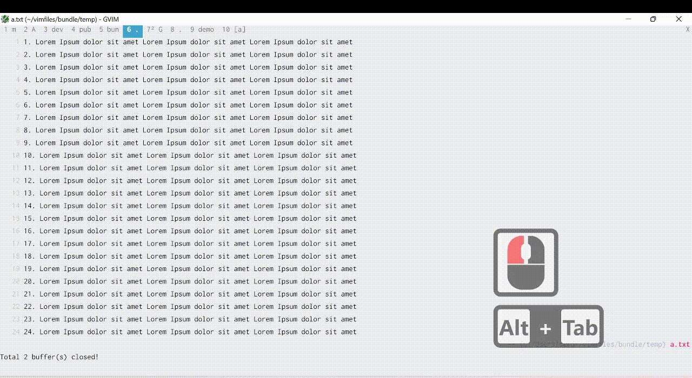

# Feature
Vim version of GitKraken. 
(Forked from [gv.vim](https://github.com/junegunn/gv.vim))

#### Demo

#### Demo part 2
https://user-images.githubusercontent.com/9797980/206067899-f1c5907c-179f-4f96-92a1-3a138b9f0603.mov

# Installation
## Pathogen

Clone this repo to your plugin folder (usually in $HOME/.vim/bundle/)

#### Dependencies
- Fugitive
